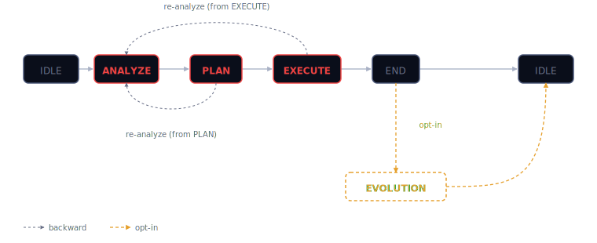

# Inquiry

**Analyze. Plan. Execute.**

A methodology for AI-assisted software development that models coding agents as a cooperative finite state machine — **Analyze → Plan → Execute → End → [Evolution] → Idle** — where the value is in the process, not the model.

**Status:** `v0.1.3` · Windows + Linux · Single-target MVP (Copilot)

This README is the public entry surface. For the repository's canonical documentation map, start at [`docs/index.md`](docs/index.md).

## What is Inquiry?

Inquiry names the cycle-level process. APE names the orchestrating methodology that schedules that process. Finite APE Machine names the engineered finite-state system that makes the methodology operational through explicit states, transitions, and artifacts. This README summarizes that model; the canonical explanations live in the documentation set.

Historical naming note: APE was the system's initial working name. The individual sub-agents still appear as apes in the lore and avatar language, but Inquiry is the current name of the system and its public identity.

**Core ideas:**

- **Agents as FSM states** — each phase has one ape; transitions are declarative, total, and validated (`code/cli/assets/transition_contract.yaml`)
- **Methodology over model** — a smaller model following Inquiry's runbook beats a frontier model freestyling
- **Memory as Code** — project memory as version-controlled markdown in `.inquiry/` and `docs/`. No vector DB, no cloud dependency
- **DARWIN** — an evolutionary meta-agent that proposes mutations to APE itself after each cycle
- **Semantic risk matrix** — human approval only when engineering judgment matters

## Quick start

### Install (Windows)

```powershell
irm https://www.si14bm.com/inquiry/install.ps1 | iex
```

### Install (Linux)

```bash
curl -fsSL https://www.si14bm.com/inquiry/install.sh | bash
```

The installer downloads the latest release, places `inquiry` (aliased as `iq`) on `PATH`, and verifies prerequisites.

### Initialize a repository

```bash
iq doctor               # verify inquiry, git, gh, gh auth
iq target get           # deploy Inquiry agent + skills to ~/.copilot
cd your-repo
iq init                 # create .inquiry/{state,config,mutations}
iq                      # show TUI banner with current FSM state
```

## Available commands

| Command | Purpose |
|---|---|
| `iq` | TUI banner with current FSM state and diagram |
| `iq init` | Idempotent scaffolding of `.inquiry/` (state.yaml, config.yaml, mutations.md) |
| `iq doctor` | Verify prerequisites: `inquiry`, `git`, `gh`, `gh auth` |
| `iq version` | Print CLI version |
| `iq upgrade` | Download and install latest release |
| `iq uninstall` | Remove `inquiry` binary and deployed assets |
| `iq target get` | Deploy Inquiry agent and skills to active AI tool (Copilot) |
| `iq target clean` | Remove deployed Inquiry files from all known targets |
| `iq state transition --event <e>` | Execute a deterministic FSM transition with prechecks/effects |

## The APE cycle



| State | Agent | Function | Output |
|---|---|---|---|
| **ANALYZE** | SOCRATES | Mayéutica — clarify requirements via dialog | `diagnosis.md` |
| **PLAN** | DESCARTES | Method — divide, order, verify, enumerate | `plan.md` |
| **EXECUTE** | BASHŌ | Techne — minimal, beautiful implementation under tests | code + commits |
| **END** | — | PR gate — `gh pr create` + `gh pr merge` | merged PR |
| **EVOLUTION** | DARWIN | Natural selection — propose Inquiry mutations | issues in this repo |

EVOLUTION is opt-in (`evolution.enabled` in `.inquiry/config.yaml`) and one-shot: if interrupted, the cycle simply returns to IDLE.

## Architecture

- **CLI:** Dart, compiled to a single cross-platform binary, built on top of [`modular_cli_sdk`](https://github.com/siliconbrainedmachines/modular_cli_sdk)
- **Modules:** `global` (init, doctor, version, upgrade, uninstall, tui), `target` (get, clean), `state` (transition)
- **FSM:** declarative `transition_contract.yaml` parsed into `FsmContract` — every (state, event) pair is total (allowed or explicitly illegal)
- **Targets:** Copilot only at present per [ADR D20](docs/spec/target-specific-agents.md). Adapters for Claude/Codex/Crush/Gemini exist for cleanup but are deferred until multi-target reactivation
- **Memory:** `.inquiry/` (per-cycle runtime), `cleanrooms/NNN-slug/` (per-cycle artifacts), `docs/spec/` (technical specifications)

## Documentation

- **[`docs/index.md`](docs/index.md)** — top-level navigation across the current documentation set
- **[`docs/research/inquiry/index.md`](docs/research/inquiry/index.md)** — canonical philosophical home of Inquiry
- **[`docs/architecture.md`](docs/architecture.md)** — canonical current explanation of APE as orchestrating methodology
- **[`docs/spec/finite-ape-machine.md`](docs/spec/finite-ape-machine.md)** — canonical technical overview of the Finite APE Machine
- **[`docs/thinking-tools.md`](docs/thinking-tools.md)** — canonical explanation of Thinking Tools in the current model
- **[`docs/spec/index.md`](docs/spec/index.md)** — status-aware navigation across technical specifications
- **[`cleanrooms/`](cleanrooms/)** — per-issue working artifacts (analysis, plan, metrics)
- **[`docs/roadmap.md`](docs/roadmap.md)** — strategic direction and long-term theses
- **[`docs/lore.md`](docs/lore.md)** — nomenclature, allegory, and historical context for the named agents
- **[`docs/adr/`](docs/adr/)** — Architecture Decision Records

## Philosophy

APE is designed to be **antifragile** across AI market scenarios. If cloud models get expensive, APE runs on local models. If frontier models plateau, DARWIN is the only improvement mechanism left. If models keep improving, APE amplifies the gains. The methodology benefits from disorder.

The collaboration model — **AAD/AAE/AAM** (Agent-Aided Design/Engineering/Manufacturing) — draws from CAD/CAE/CAM: humans design with AI assistance, co-engineer with AI execution, and delegate mechanical work to automation. The risk matrix calibrates where each action falls on that spectrum.

## License

MIT

## Related work

The idea of a CLI that **installs prompts and skills** into whatever AI coding agent you use — instead of keeping custom agents and skills scattered across each tool's config — comes from [gentle-ai](https://github.com/Gentleman-Programming/gentle-ai) (Gentleman Programming). Inquiry takes that packaging idea in a different direction: a single-target deterministic FSM contract enforced by the CLI, with the methodology itself as the durable artifact.
