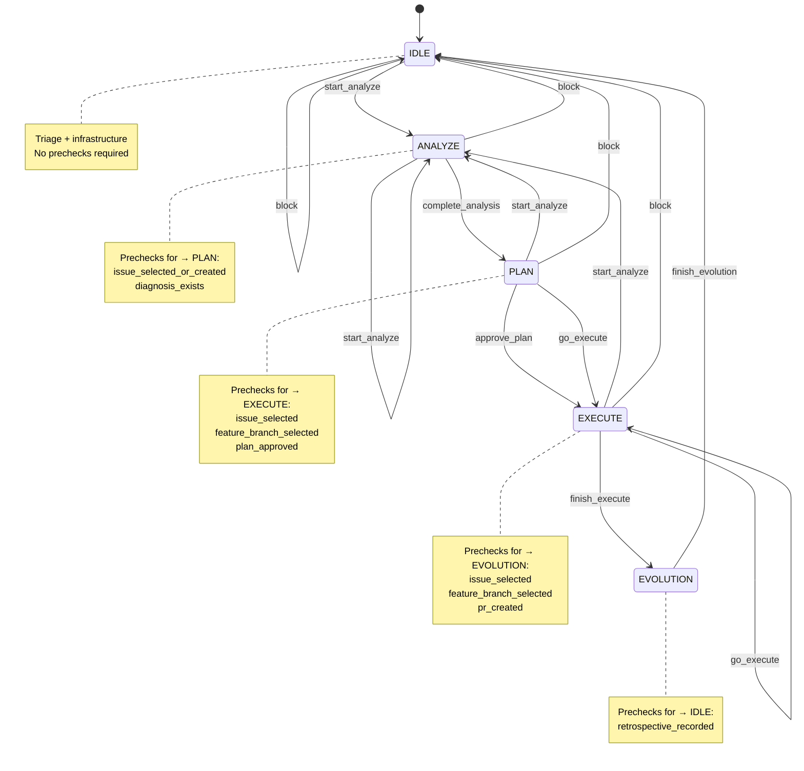

# APE FSM — Transition Diagram

> Auto-generated from `transition_contract.yaml`. Only **allowed** transitions shown.

```mermaid
stateDiagram-v2
    [*] --> IDLE

    IDLE --> ANALYZE : start_analyze
    IDLE --> IDLE : block

    ANALYZE --> ANALYZE : start_analyze
    ANALYZE --> PLAN : complete_analysis
    ANALYZE --> IDLE : block

    PLAN --> ANALYZE : start_analyze
    PLAN --> EXECUTE : approve_plan
    PLAN --> EXECUTE : go_execute
    PLAN --> IDLE : block

    EXECUTE --> ANALYZE : start_analyze
    EXECUTE --> EVOLUTION : finish_execute
    EXECUTE --> EXECUTE : go_execute
    EXECUTE --> IDLE : block

    EVOLUTION --> IDLE : finish_evolution

    note right of IDLE
        Triage + infrastructure
        No prechecks required
    end note

    note right of ANALYZE
        Prechecks for → PLAN:
        issue_selected_or_created
        diagnosis_exists
    end note

    note right of PLAN
        Prechecks for → EXECUTE:
        issue_selected
        feature_branch_selected
        plan_approved
    end note

    note right of EXECUTE
        Prechecks for → EVOLUTION:
        issue_selected
        feature_branch_selected
        pr_created
    end note

    note right of EVOLUTION
        Prechecks for → IDLE:
        retrospective_recorded
    end note
```
